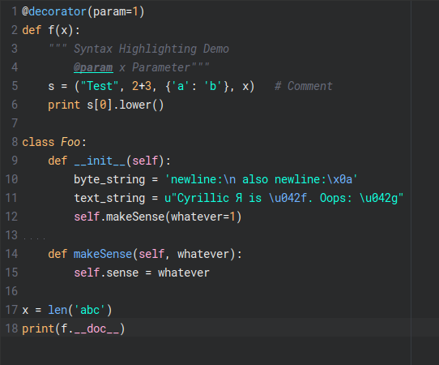

# pycharm-panda-syntax

> A somewhat port of [@siamak](https://github.com/siamak)'s [atom-panda-syntax](https://github.com/siamak/atom-panda-syntax) for PyCharm.



## Install

Clone this repo and cd into it
```
git clone https://github.com/mlcdf/pycharm-panda-syntax && cd pycharm-panda-syntax
```

Copy Panda.icls to your PyCharm config folder.
```
cp Pand.icls ~/.PyCharm[YEAR].[MAJOR_NUMBER_VERSION]/config/colors/
```
If your PyCharm is up to date, it should be something like `~/.PyCharm2016.1/config/colors/`

And voila! :clap:
